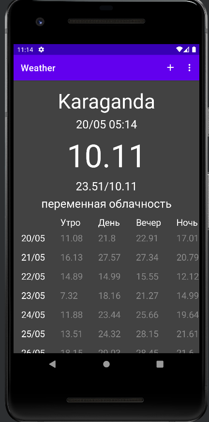

<h1 align="center">Приложение для прогноза погоды</h1>

<h1 align="center">Немного о проекте</h1>

Данный проект создан, как итоговое задание для предмета Технологии Разработки Программных приложений

Данную итоговую работ выполнили студенты группы ИНБО-02-20:

<ul>
    <li>Аладинский.Г.А.</li>
    <li>Мандал.Д.Т.</li>
    <li>Самойленко.М.А.</li>
</ul>

 В данном проекте было созданно приложении для просмотра прогноза погоды любого города мира

Хотите посмотреть погоду в Мадриде смотрите 

 

Хотите посмотреть погоду в караганде не вопрос

 

 

Приложение так же запоминает ваши последние поиски, что бы в случае необходимости вы смогли вернутся обратно

   
<h1 align="center"> Итоги </h1>

В итоге было спроектировано и реализовано приложение для просмотра погоды, с помощью которого можно получать точный прогноз погоды для любого города мира

### [Просмотреть Manifest.xml](https://github.com/Goga270/Weather/blob/main/app/src/main/AndroidManifest.xml)
### [Просмотреть основные файлы проекта](https://github.com/Goga270/Weather/tree/main/app/src/main/java/com/example/weather)
### [Просмотреть ресурсы приложения](https://github.com/Goga270/Weather/tree/main/app/src/main/res)